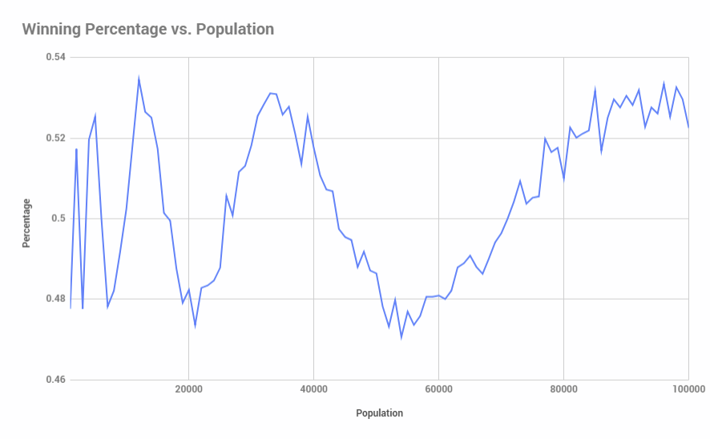
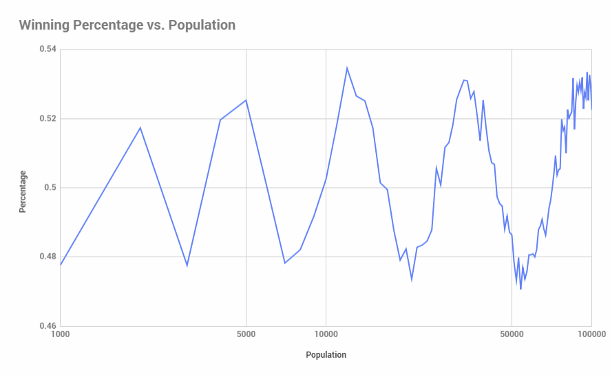
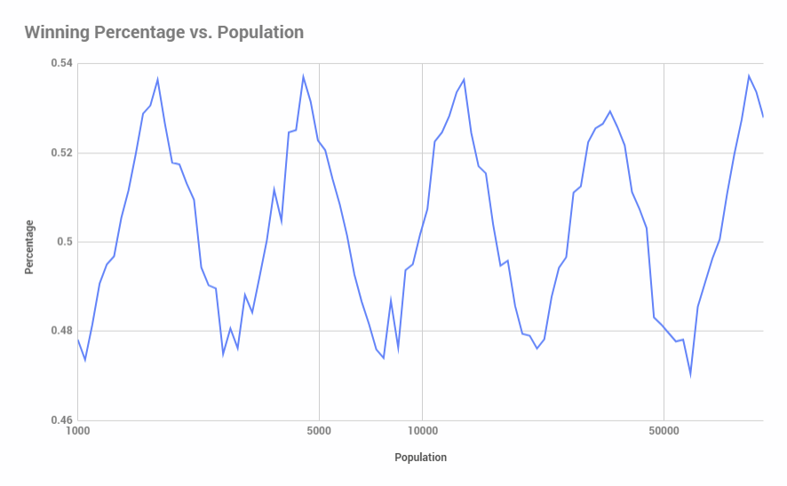
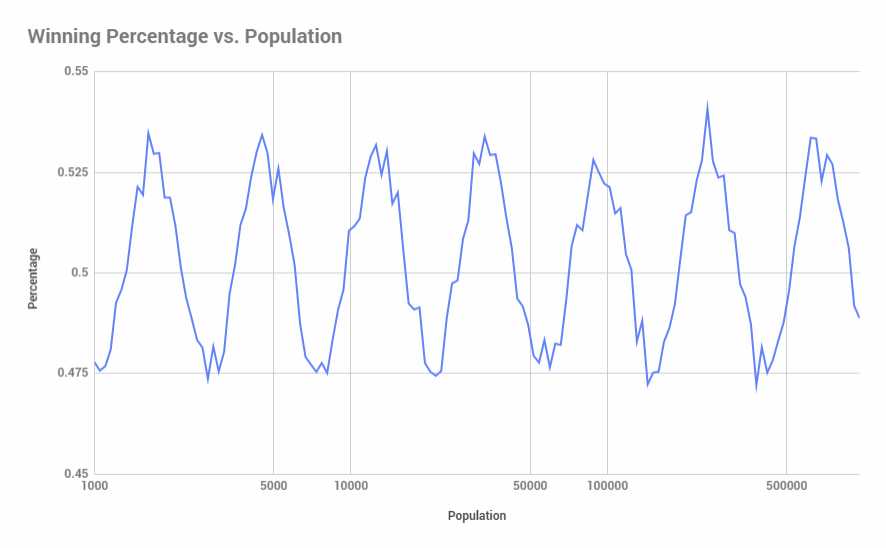
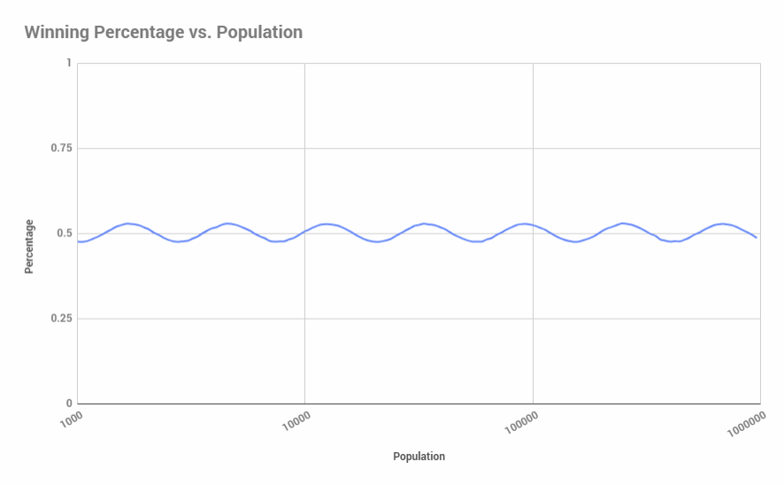

### Riddler Classic 11/18/2016

Original post [here](https://fivethirtyeight.com/features/the-puzzle-of-the-lonesome-king/) (fivethirtyeight.com).

A coronation probability puzzle from Charles Steinhardt:

The childless King of Solitaria lives alone in his castle. Overly lonely, the king one day offers one lucky subject the chance to be prince or princess for a day. The loyal subjects leap at the opportunity, having heard tales of the opulent castle and decadent meals that will be lavished upon them. The subjects assemble on the village green, hoping to be chosen.

The winner is chosen through the following game. In the first round, every subject simultaneously chooses a random other subject on the green. (It’s possible, of course, that some subjects will be chosen by more than one other subject.) Everybody chosen is eliminated. (Not killed or anything, just sent back to their hovels.) In each successive round, the subjects who are still in contention simultaneously choose a random remaining subject, and again everybody chosen is eliminated. If there is eventually exactly one subject remaining at the end of a round, he or she wins and heads straight to the castle for fêting. However, it’s also possible that everybody could be eliminated in the last round, in which case nobody wins and the king remains alone. If the kingdom has a population of 56,000 (not including the king), is it more likely that a prince or princess will be crowned or that nobody will win?

_Extra credit_: How does the answer change for a kingdom of arbitrary size?

### Answer:

I wrote a short program to simulate the results of this process for population sizes from 1,000 to 100,000:

```c++
#include <stdlib.h>
#include <iostream>
#include <iomanip>
#include <fstream>
#include <vector>
#include <random>

int main() {

   std::string header = "Population\tWinners\tLosers\tPercentage";

   std::cout << header << std::endl;

   // minimum size of population
   constexpr unsigned int minPopulation = 1000;
   constexpr unsigned int maxPopulation = 100000;
   constexpr unsigned int populationStepSize = 1000;
   constexpr unsigned int iterationsPerStep = 1000;

   std::random_device randomDevice;
   std::mt19937 generator(randomDevice());

   for (unsigned int populationSize = minPopulation; populationSize <= maxPopulation; populationSize += populationStepSize) {

      unsigned long winners = 0;
      unsigned long losers = 0;

      std::vector<bool> people(populationSize, true);
      for (unsigned int j = 0; j < iterationsPerStep; j++) {

         unsigned int peopleRemaining = populationSize;

         do {
            std::uniform_int_distribution<unsigned int> distribution(0, peopleRemaining - 1);

            for (unsigned int i = 0; i < peopleRemaining; i++) {
               unsigned int choice;
               // subjects do not choose themselves, presumably
               do {
                  choice = distribution(generator);
               }
               while (choice == i);
               people[choice] = false;
            }

            unsigned int newPeopleRemaining = 0;

            for (unsigned int i = 0; i < peopleRemaining; i++) {
               newPeopleRemaining = people[i] ? newPeopleRemaining + 1 : newPeopleRemaining;
               people[i] = true;
            }

            peopleRemaining = newPeopleRemaining;

         } while (peopleRemaining > 1);

         winners = (peopleRemaining == 1) ? winners + 1 : winners;
         losers = (peopleRemaining == 0) ? losers + 1 : losers;
      }
      float winningPercentage = winners / (float)(winners + losers);
      float losingPercentage = losers / (float)(winners + losers);

      std::cout << std::fixed;

      std::cout << populationSize << "\t\t" << winners << "\t\t" << losers << "\t\t";

      std::cout << std::fixed << std::setprecision(4) << winningPercentage << std::endl;
   }
}
```

The program above runs the simulation `iterationPerStep` times for each population size, and averages the result. 

For n = 56,000, there turns out to be a <strong>48%</strong> chance that there's a winner. 

It takes a while to run enough iterations for the result to converge for any given population size. The program above is single-threaded, but the problem is trivially parallelizable. I've implemented a multi-threaded version [here](https://github.com/danielthompson/riddler-solitaria/blob/master/multithreaded.cpp) (github.com) that runs `[number of cores] * iterationsPerStep` iterations (Warning: this will spike your CPU!). 

_Note: The following graphs were produced by the multi-threaded version, taking 16,000 samples at each population size._

There is a winner about 50% of the time regardless of population size. Plotting winning percentage against population size shows an interesting pattern:



Modifying the horizontal axis to log scale shows the following:



We can smooth this out a bit by modifying our population step size to grow by a percentage (say, 5%) instead of a fixed number (1000 in the code above):



Increasing the step size by a percentage allows us to increase the upper limit of population size with less of an execution time penalty. Looking at population size out to 1,000,000:



Finally, we can get arbitrarily close to the true percentage at population size by increasing the sample size. Here's what it looks like for 512,000 samples (with a y-axis adjustment):



