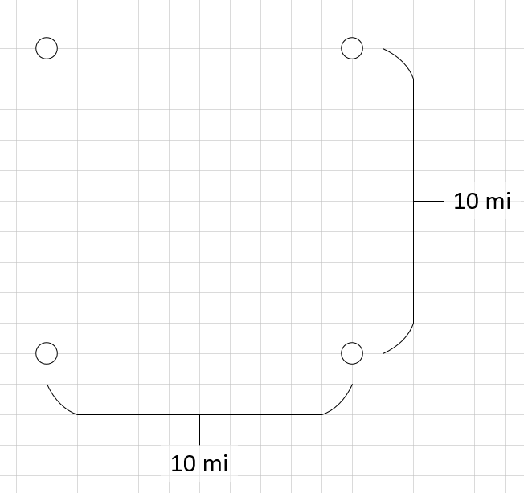
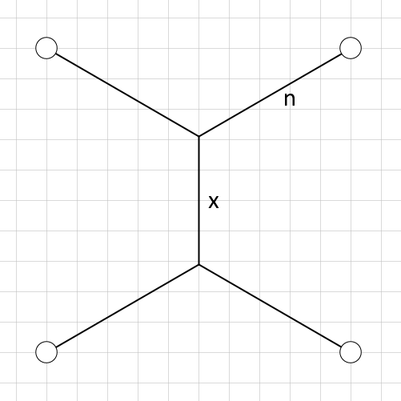
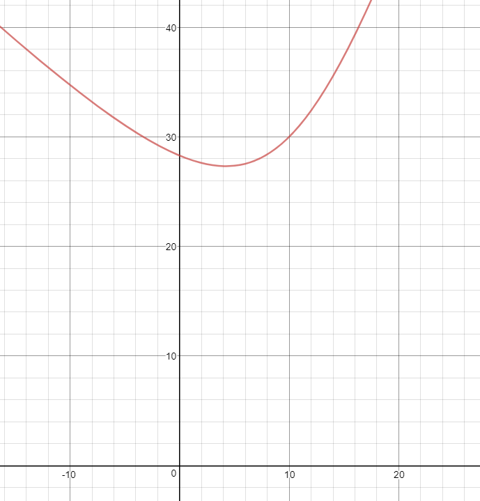
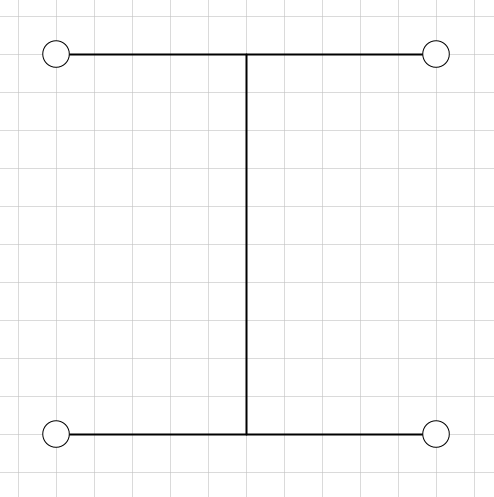
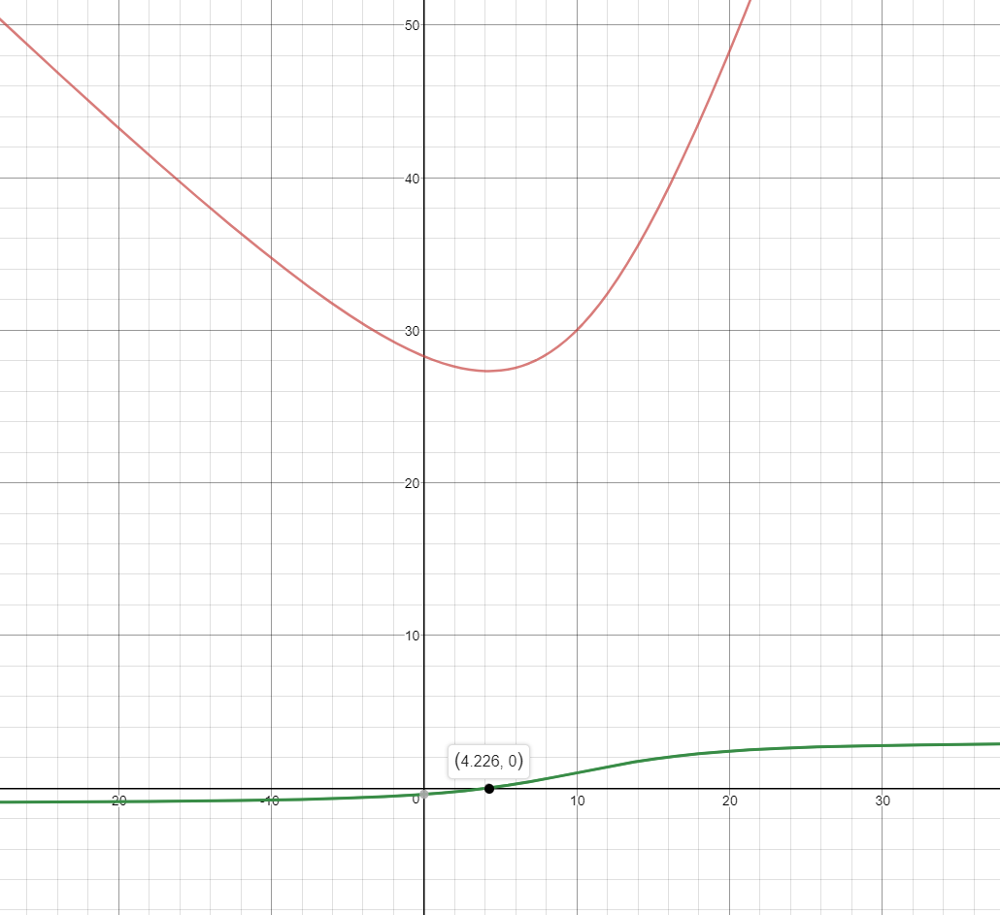
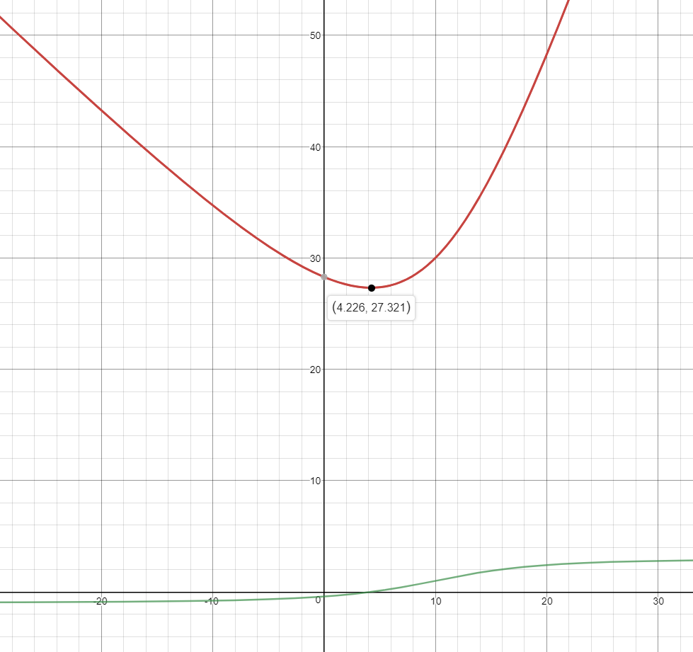

### Riddler Classic 6/1/2018

Original post [here](https://fivethirtyeight.com/features/when-will-your-house-collapse-should-you-take-a-construction-contract/) (fivethirtyeight.com).

From David Seal, a classic construction problem perfect for Infrastructure Week:

Consider four towns arranged to form the corners of a square, where each side is 10 miles long. You own a road-building company. The state has offered you $28 million to construct a road system linking all four towns in some way, and it costs you $1 million to build one mile of road. Can you turn a profit if you take the job?

_Extra credit_: How does your business calculus change if there were five towns arranged as a pentagon? Six as a hexagon? Etc.?

### Answer:

Ollie clarified on Twitter that we should think of the towns as points at the corners of a square:

_NOTE: The gridlines represent miles; each side has length 10:_

By a kind of heuristic / guessing / iterative reduction method, I found that the shortest graph I could come up with that connects those four points looked like this:

Assuming the four outlying segments have the same length, that length is a function of the length of the center segment.

I tried to come up with `y = f(x)`, where `f(x)` describes the length of all 5 segments.

- `y = f(x)` => total length of all segments
- `x` => length of center segment
- `n` => length of outlying segment

From first principles, the length of all sides is 4 * the length of an outlying segment + the length of the center segment:

=> `y = 4n + x`

To determine `n`, I tried some example values:

`x` | `n`
--- | ---
`0` | `sqrt(5^2 + 5^2)`
`1` | `sqrt(5^2 + (4.5^2)`
`2` | `sqrt(5^2 + (4^2)`

From this it became clear that 

Plugging that into the original equation for `y`, we have

Graphing that, courtesy of https://www.desmos.com/calculator:

The way to interpret this is is:

- Values of `x < 0` are not meaningful.

- At `x = 0`, the center segment degenerates to a point, and the diagram looks like this:

The length here is just over $28m (`2 * 10 * sqrt(2)`).

- At `x ~ 4`, there's a local minimum and the diagram looks like this:

- At `x = 10`, the outlying segments become completely orthogonal to the center segment and the diagram looks like this:

_Note that the graph shows `y = 30` for `x = 10`, which is verifiable by inspection._

- At `x > 10`, the outlying segments actually tilt away from the center, and the length can grow without bound.

So, there is a minimum in cost at around `x ~ 4`. To find that mininum, we calculate the derivative of `y`, `y'`:

Setting that equal to `0` and solving (and graphing) shows that the minimum occurs at `x = 4.226`:

Plugging `x = 4.226` into the original equation for `y` shows that the minimum cost is `y ~ 27.321`:

Therefore, since the budget is $28m, we can construct the road at a minimum cost of about $27.321m, which is profitable.
