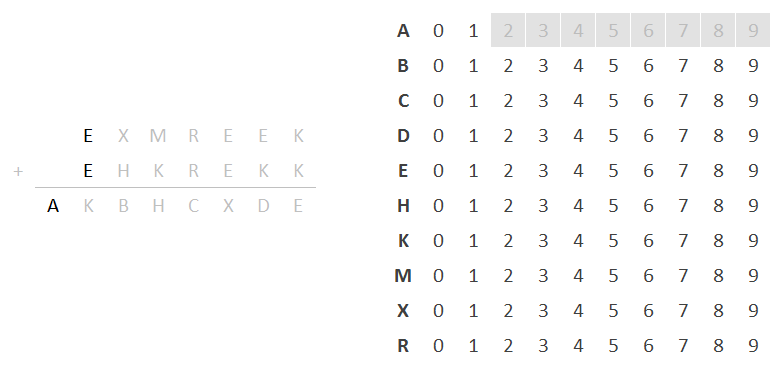
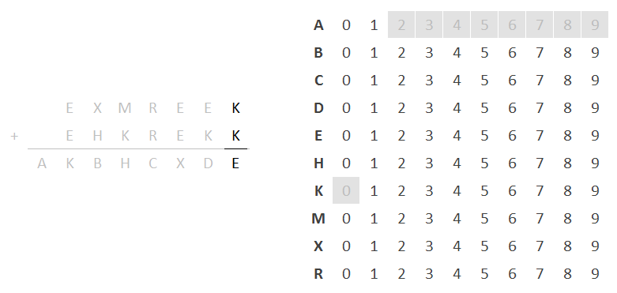
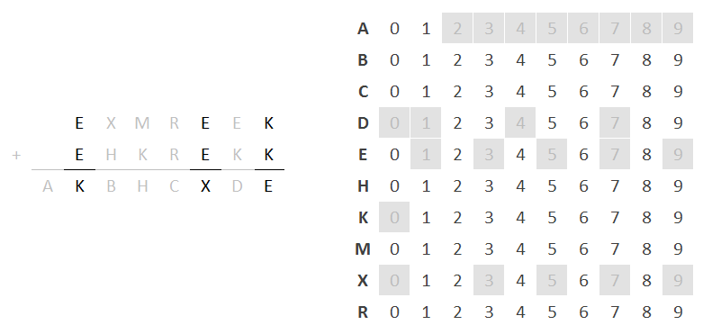
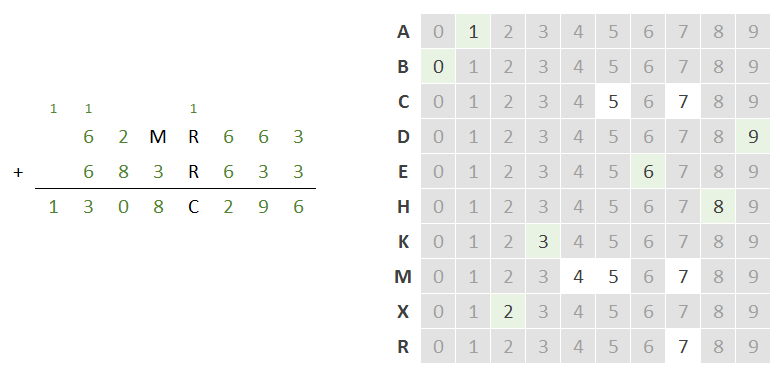

### Riddler Express 6/8/2018

Original post [here](https://fivethirtyeight.com/features/the-case-of-the-smudged-secret-message/) (fivethirtyeight.com).

From Max Rosmarin, a puzzle of villainous improv:

Imagine a group of five improvisers performing the following acting exercise: They all begin a scene together, establishing a character for themselves. Halfway through the scene, each improviser switches to a character someone else has been playing, such that the same five characters remain for the entire scene but no one plays the same character in both halves. As it happens, two of the characters in the scene are villains, and three are heroes.

Assuming that every valid reallocation of characters is equally likely, what is the probability that at least one of the actors plays a villain in both halves of the scene?

### Answer:

**45.45%**

I started by laying out the people and role combinations in a table, like so:

Person / Role  |1 - V|2 - V|3 - H|4 - H|5 - H
-|-|-|-|-
A|X| | | | 
B| |X| | | 
C| | |X| | 
D| | | |X| 
E| | | | |X

Each lettered person starts out with a numbered role (either V or H) denoted by *X*.

There are 5 * 4 * 3 * 2 * 1 = 120 permutations of people/role assignments. However, since no person can occupy their original role, only 44 of those 120 permutations are valid. 

> Note: I didn't know what these "no-repeated-position" permutations were called, nor could I derive a formula to calculate them - I had to write a short script to calculate them directly. It turns out they are called *derangements* of the original sequence (see [Wikipedia](https://en.wikipedia.org/wiki/Derangement)).

So, how many of those 44 include * A * * * or B * * * *?

**BA**DEC|**BA**ECD|**B**CAED|**B**CDEA 
**B**CEAD|**B**DAEC|**B**DEAC|**B**DECA
**B**EACD|**B**EDAC|**B**EDCA|C**A**BED
C**A**DEB|C**A**EBD|CDAEB|CDBEA
CDEAB|CDEBA|CEABD|CEBAD
CEDAB|CEDBA|D**A**BEC|D**A**EBC
D**A**ECB|DCAEB|DCBEA|DCEAB
DCEBA|DEABC|DEACB|DEBAC
DEBCA|E**A**BCD|E**A**DBC|E**A**DCB
ECABD|ECBAD|ECDAB|ECDBA
EDABC|EDACB|EDBAC|EDBCA

Counting those up = 20 / 44 = 5 / 11 = 45.45%

### Riddler Classic 6/8/2018

Original post [here](https://fivethirtyeight.com/features/the-case-of-the-smudged-secret-message/) (fivethirtyeight.com).

From Ben Gundry via Eric Emmet, find and replace with a twist:

Riddler Nation has been enlisted by the Pentagon to perform crucial (and arithmetical) intelligence gathering. Our mission: decode two equations. In each of them, every different letter stands for a different digit. But there is a minor problem in both equations.

In the first equation, letters accidentally were smudged on their clandestine journey to a safe room within Riddler Headquarters and are now unreadable. (These are represented with dashes below.) But we know that all 10 digits, 0 through 9, appear in the equation.


What digits belong to what letters, and what are the dashes?

In the second equation, our mathematical spies have said that one of the letters in the equation is wrong. But they can’t remember which one. Which is it?


### Answer (1st equation):

Start by replacing the blanks with symbols:


There are 10 distinct symbols:

E H K M R X A B C D

Not shown in the original problem are each column's carry digit, which are each either 0 or 1.

A is a special case in that it is effectively the carry digit for E + E. S. Therefore, A must be either 0 or 1.



Since all symbols are distinct, K cannot be 0, because that would cause E to also be 0.



Since 2 * any integer must be even, and the answer's rightmost column cannot have had a carry digit added to it, E cannot be odd.


Adding up all the possibilities for K and E to determine D (making sure to carry the 1, if needed):

K|E|D
-|-|-
1|2|3
2|4|6
3|6|9
4|8|<sup>1</sup>2
5|<sup>1</sup>0|6
6|<sup>1</sup>2|9
7|<sup>1</sup>4|<sup>1</sup>2
8|<sup>1</sup>6|<sup>1</sup>5
9|<sup>1</sup>8|<sup>1</sup>8

This eliminates D = 0, 1, 4, 7


Continuing on for X:

D|E|X
-|-|-
2/5/8|0|1
-|2|4
-|4|8
-|6|<sup>1</sup>2
-|8|<sup>1</sup>6

This eliminates X = 0, 3, 5, 7, 9


Next, notice the following two columns:

- E + E + 1? = K
- K + K = E



E + E = K might have a carry digit, but K + K = E doesn't. So, we can construct a truth table for the possible values of K and E and see which values satisfy both equations:

K|E|K + K = E|E + E + <sup>1?</sup> = K 
-|-|-|-
1|2|1 + 1 = 2 => True|2 + 2 + 1? = 1 => False
2|4|2 + 2 = 4 => True|4 + 4 + 1? = 2 => False
3|6|3 + 3 = 6 => True|6 + 6 + 1? = 3 => True
4|8|4 + 4 = 8 => True|8 + 8 + 1? = 4 => False
5|<sup>1</sup>0|5 + 5 = <sup>1</sup>0 => True|0 + 0 + 1? = 5 => False
6|<sup>1</sup>2|6 + 6 = <sup>1</sup>2 => True|2 + 2 + 1? = 6 => False
7|<sup>1</sup>4|7 + 7 = <sup>1</sup>4 => True|4 + 4 + 1? = 7 => False
8|<sup>1</sup>6|8 + 8 = <sup>1</sup>6 => True|6 + 6 + 1? = 8 => False
9|<sup>1</sup>8|9 + 9 = <sup>1</sup>8 => True|8 + 8 + 1? = 9 => False

Therefore, K = 3 and E = 6, and there's a carry digit in column 2. Recall that column 1 is just the carry digit of column 2, so A = 1.


Then, we can fill out D = 9 and X = 2 by inspection:


Halfway there!

Next, note that 1 + R + R = C.

Plugging this into a truth table with our remaining values:

R|1 + R + R|C Available?
-|-|-
0|1|No
4|9|No
5|1|No
7|5|Yes
8|7|Yes

Therefore, we can eliminate R = 0, 4, and 5, and C = 0, 4, 8:


Next, note that in column 3, we have 2 + H = B, and that 2 + H must create a carry digit. 


What values of H and B could satisfy this?

H|2 + H + 1?|B available?|Creates carry digit in column 2?
-|-|-|-
0|2 + 1?|No|No
4|6 + 1?|Yes|No
5|7 + 1?|Yes|No
7|9 + 1?|No|Yes
8|0 + 1?|Yes|Yes

Therefore, H = 8 and B = 2.



Now we can use Sudoku-like deduction on our grid to fill out the rest of the puzzle:

- R = 7, since that's the only possible value left for R


- M = 4, since M is the only symbol left that can be 4


- C = 5, since that's the only remaining symbol and value pair.


That leaves us with an equation: 6,247,663 + 6,837,633 = 13,085,296, which you can verify is true by doing the addition.

### Answer (2nd equation):

This one stumped me, so I wrote a short C++ program to brute force it (code included at bottom of answer).

The output of the program shows the following:

```
Original letters: 
    Y T B B E D M K D
+   Y H D B T Y Y D D 
  -------------------
  E D Y T E R T P T Y 

NOTE: Indexes are zero-based from the top right (index 0) to the bottom left (index 27).

Found match(es) in base permutation: 
B	5
D	3
E	1
H	7
K	4
M	2
P	8
R	0
T	9
Y	6

Decoded letters from base permutation (sum is false): 
    6 9 5 5 1 3 2 4 3
+   6 7 3 5 9 6 6 3 3 
  -------------------
  1 3 6 9 1 0 9 8 9 6 

Can make into a valid sum by switching term 1
from K/4 to Y/6

    6 9 5 5 1 3 2*6*3 
+   6 7 3 5 9 6 6 3 3 
  -------------------
  1 3 6 9 1 0 9 8 9 6 

Can make into a valid sum by switching term 10
from D/3 to B/5

    6 9 5 5 1 3 2 4 3 
+   6 7 3 5 9 6 6*5*3 
  -------------------
  1 3 6 9 1 0 9 8 9 6 

Can make into a valid sum by switching term 19
from T/9 to H/7

    6 9 5 5 1 3 2 4 3 
+   6 7 3 5 9 6 6 3 3 
  -------------------
  1 3 6 9 1 0 9 8*7*6 
```

With the letter -> number mapping I found, there are actually three different replacements that could be made to make the sum true. The first one causes the digit 4 to be absent from the decoded addends and sum, which violates the rules. Both the second and third ones are valid according to the rules, as far as I can tell. 


```c++
#include <iostream>
#include <algorithm>
#include <vector>

constexpr char letters[] = {'B', 'D', 'E', 'H', 'K', 'M', 'P', 'R', 'T', 'Y'};

std::vector<int> digits = {0, 1, 2, 3, 4, 5, 6, 7, 8, 9};

const std::vector<int> origTermIndices = {
      1, 4, 5, 1, 2, 0, 0, 8, 9,
      1, 1, 9, 9, 8, 0, 1, 3, 9,
      9, 8, 6, 8, 7, 2, 8, 9, 1, 2
};

void print(const std::vector<int> &indices, const bool printLetters, int highlightIndex) {
   std::cout << "    ";
   for (int k = 8; k >= 0; k--) {
      if (highlightIndex == k) {
         std::cout << '*';
      }
      if (printLetters) {
         std::cout << letters[indices[k]];
      }
      else {
         std::cout << digits[indices[k]];
      }
      if (highlightIndex == k) {
         std::cout << '*';
      }
      else if (highlightIndex != k - 1) {
            std::cout << ' ';
      }
   }

   std::cout << std::endl;

   std::cout << "+   ";
   for (int k = 17; k >= 9; k--) {
      if (highlightIndex == k) {
         std::cout << '*';
      }
      if (printLetters) {
         std::cout << letters[indices[k]];
      }
      else {
         std::cout << digits[indices[k]];
      }
      if (highlightIndex == k) {
         std::cout << '*';
      }
      else if (highlightIndex != k - 1) {
         std::cout << ' ';
      }
   }

   std::cout << std::endl << "  -------------------" << std::endl;

   std::cout << "  ";
   for (int k = 27; k >= 18; k--) {
      if (highlightIndex == k) {
         std::cout << '*';
      }
      if (printLetters) {
         std::cout << letters[indices[k]];
      }
      else {
         std::cout << digits[indices[k]];
      }
      if (highlightIndex == k) {
         std::cout << '*';
      }
      else if (highlightIndex != k - 1) {
         std::cout << ' ';
      }
   }

   std::cout << std::endl << std::endl;
}

int main() {

   std::cout << "Original letters: " << std::endl;
   print(origTermIndices, true, -1);

   std::cout << "NOTE: Indexes are zero-based from the top right (index 0) to the bottom left (index 27)." << std::endl << std::endl;

   std::vector<int> termIndices = {
         1, 4, 5, 1, 2, 0, 0, 8, 9,
         1, 1, 9, 9, 8, 0, 1, 3, 9,
         9, 8, 6, 8, 7, 2, 8, 9, 1, 2
   };

   bool shouldPrintPermutation;

   do {
      shouldPrintPermutation = true;

      // switch place
      for (int i = 0; i < termIndices.size(); i++) {

         // the original term for this try
         int orig = termIndices[i];
         // switch number
         for (int j = 0; j < 10; j++) {

            termIndices[i] = j;
            long term1 =
                  1 * digits[termIndices[0]] +
                  10 * digits[termIndices[1]] +
                  100 * digits[termIndices[2]] +
                  1000 * digits[termIndices[3]] +
                  10000 * digits[termIndices[4]] +
                  100000 * digits[termIndices[5]] +
                  1000000 * digits[termIndices[6]] +
                  10000000 * digits[termIndices[7]] +
                  100000000 * digits[termIndices[8]];

            long term2 =
                  1 * digits[termIndices[9]] +
                  10 * digits[termIndices[10]] +
                  100 * digits[termIndices[11]] +
                  1000 * digits[termIndices[12]] +
                  10000 * digits[termIndices[13]] +
                  100000 * digits[termIndices[14]] +
                  1000000 * digits[termIndices[15]] +
                  10000000 * digits[termIndices[16]] +
                  100000000 * digits[termIndices[17]];

            long expectedSum =
                  1 * digits[termIndices[18]] +
                  10 * digits[termIndices[19]] +
                  100 * digits[termIndices[20]] +
                  1000 * digits[termIndices[21]] +
                  10000 * digits[termIndices[22]] +
                  100000 * digits[termIndices[23]] +
                  1000000 * digits[termIndices[24]] +
                  10000000 * digits[termIndices[25]] +
                  100000000 * digits[termIndices[26]] +
                  1000000000 * digits[termIndices[27]];

            long sum = term1 + term2;

            if (sum == expectedSum) {

               if (shouldPrintPermutation) {
                  std::cout << "Found match(es) in base permutation: " << std::endl;

                  for (int k = 0; k < 10; k++) {
                     std::cout << letters[k] << '\t' << digits[k] << std::endl;
                  }
                  std::cout << std::endl;

                  std::cout << "Decoded letters from base permutation (sum is false): " << std::endl;

                  print(origTermIndices, false, -1);
                  shouldPrintPermutation = false;
               }
               std::cout << "Can make into a valid sum by switching term " << i << std::endl;
               std::cout << "from " << letters[orig] << "/" << digits[orig];
               std::cout << " to " << letters[j] << "/" << digits[j] << std::endl;
               std::cout << std::endl;


               print(termIndices, false, i);
            }
            termIndices[i] = orig;
         }
      }

   } while (std::next_permutation(digits.begin(), digits.end()));

   return 0;
}
```