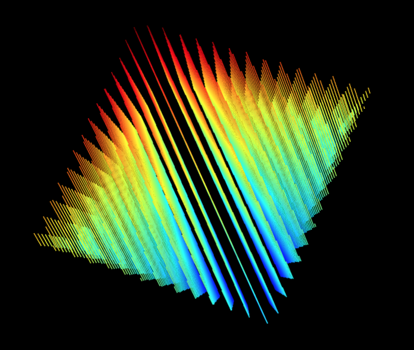
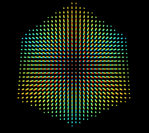
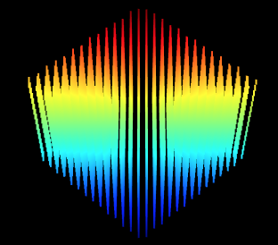

### Riddler Express 9/13/2019

Original post [here](https://fivethirtyeight.com/features/can-you-help-dakota-jones-raid-the-lost-arc/) (fivethirtyeight.com).

At long last, Dakota Jones is close to finding the Lost Arc, a geometric antiquity buried deep in the sands of Egypt. Along the way, she discovered what she described as a “highly symmetric crystal” that’s needed to precisely locate the Arc. Dakota measured the crystal using her laser scanner and relayed the results to you. But nefarious agents have gotten wind of her plans, and Dakota and the crystal are nowhere to be found.

Locating the Arc is now up to you. To do that, you must recreate the crystal using the data from Dakota’s laser scanner. The scanner takes a 3D object, and records 2D cross-sectional slices along the third dimension. Here’s the looping animation file the scanner produced for the crystal:


What sort of three-dimensional shape is the crystal? No pressure — Dakota Jones, nay, the entire world, is counting on you to locate the Lost Arc and ensure its place in a museum!

### Answer:

A **cube**. The camera moves along a vector from one corner to the opposite corner.

I started by decomposing the gif file into its constituent frames, for a total of 301 image slices.

|  |  |  |
| ------------- | ------------- | ------------- |
|   |   |   |
|   |   |   |
|   |   |   |
|   |   | |

Then, I wrote a short program that:

 * Samples each image slice at regular intervals
 * Generates a point in 3D space for each sampled point that's inside the shape in each slice
 * Outputs those points into a text file

Each image is 388x355, so I sampled in a square grid every 10 pixels. This results in a [point cloud](pointcloud.txt) in which every point is inside whatever the shape is:

```
# x y z, where x and y are image coordinates and z is the depth coordinate, for which I just used the image sequence number
190 180 4
190 180 5
200 180 5
190 180 6
200 180 6
190 180 7
200 180 7
190 170 8
190 180 8
200 180 8
190 170 9
190 180 9
200 180 9
190 170 10
190 180 10
200 180 10
190 170 11
... etc
```

Visualizing the cloud (courtesy of [LidarView](http://lidarview.com/)) looks like this:







Hmm. Looks kind of like a crystalline structure, but honestly it's hard to tell.

Next, I used [MIConvexHull](https://designengrlab.github.io/MIConvexHull/) to generate the [convex hull](https://en.wikipedia.org/wiki/Convex_hull) of my point cloud. Not only does that library output the points that make up the hull, but it also outputs the triangular faces of the hull. I outputted the hull faces to an [OBJ file](convexhull.obj) ([a very simple 3D model format](https://en.wikipedia.org/wiki/Wavefront_.obj_file)):

```
v 200 180 5
v 200 150 23
v 190 140 26
f 1 2 3
v 330 250 106
v 330 210 132
v 330 100 200
f 4 5 6
v 200 180 5
v 250 210 41
v 310 240 86
f 7 8 9
v 190 330 201
v 200 330 197
v 200 330 191
f 10 11 12
... etc
```

...and then used an online OBJ viewer to visualize it:


