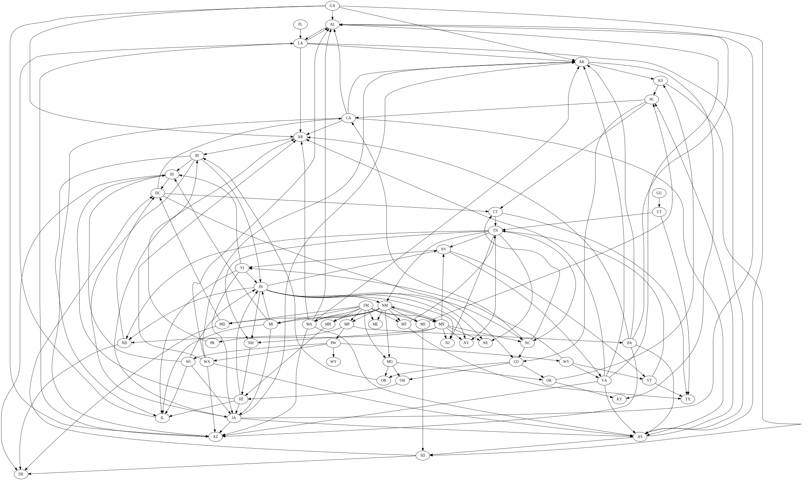

### Riddler Express 9/13/2019

Original post [here](https://fivethirtyeight.com/features/can-you-help-dakota-jones-raid-the-lost-arc/) (fivethirtyeight.com).

At long last, Dakota Jones is close to finding the Lost Arc, a geometric antiquity buried deep in the sands of Egypt. Along the way, she discovered what she described as a “highly symmetric crystal” that’s needed to precisely locate the Arc. Dakota measured the crystal using her laser scanner and relayed the results to you. But nefarious agents have gotten wind of her plans, and Dakota and the crystal are nowhere to be found.

Locating the Arc is now up to you. To do that, you must recreate the crystal using the data from Dakota’s laser scanner. The scanner takes a 3D object, and records 2D cross-sectional slices along the third dimension. Here’s the looping animation file the scanner produced for the crystal:


What sort of three-dimensional shape is the crystal? No pressure — Dakota Jones, nay, the entire world, is counting on you to locate the Lost Arc and ensure its place in a museum!

### Answer:

At least a **[trigonal trapezohedron](https://en.wikipedia.org/wiki/Trigonal_trapezohedron)**, and maybe one that is a **cube**. Since no information is given on the resolution of the slices (how "thick" they are), there is no way to tell whether the faces are rhombi or squares (if the former, it's just a trigonal trapezohdron, if the latter, it's a cube).

I started by decomposing the gif file into its constituent frames, for a total of 301 image slices.

|   |   |   |
|   |   |   |
|   |   |   |

Then, I wrote a short program that:

 * Samples each image slice at regular intervals
 * Generates a point in 3D space for each sampled point that's inside the shape in each slice
 * Outputs those points into a text file

```csharp
using System;
using System.Collections.Generic;
using System.Drawing;
using System.IO;
using System.Linq;
using System.Text;
using MIConvexHull;

namespace Sampler
{
   class Program
   {
      static void Main(string[] args)
      {
         // get all images in directory, sorted by name
         DirectoryInfo directory = new DirectoryInfo("/slices/");
         List<FileInfo> files = directory.GetFiles("*.gif").OrderBy(p => p.Name).ToList();
         int current = 0;
         List<Point> points = new List<Point>();
         StringBuilder pointcloudBuilder = new StringBuilder();
         int overallNumSamples = 0;

         foreach (FileInfo file in files)
         {
            Bitmap bitmap = new Bitmap(Image.FromFile(file.FullName));
            double z = current++;

            int numSamples = 0;

            for (int x = 0; x < bitmap.Width; x += 10)
            {
               for (int y = 0; y < bitmap.Height; y += 10)
               {
                  // perform sample
                  Color color = bitmap.GetPixel(x, y);

                  // add point to list, if needed
                  if (color.R < 250 || color.G < 250 || color.B < 250)
                  {
                     numSamples++;
                     points.Add(new Point(){x=x, y=y, z=z});
                     pointcloudBuilder.AppendLine($"{x} {y} {z}");
                  }
               }
            }

            overallNumSamples += numSamples;

            Console.WriteLine($"file {file.Name} had {numSamples} samples written");
         }

         double[][] vertices = new double[overallNumSamples][];

         for (int i = 0; i < vertices.Length; i++)
         {
            vertices[i] = new[] {points[i].x, points[i].y, points[i].z};
         }

         var convexHull = ConvexHull.Create(vertices);

         StringBuilder objBuilder = new StringBuilder();

         int vertexIndex = 1;

         foreach (DefaultConvexFace<DefaultVertex> face in convexHull.Result.Faces)
         {
            objBuilder.AppendLine($"v {face.Vertices[0].Position[0]} {face.Vertices[0].Position[1]} {face.Vertices[0].Position[2]}");
            objBuilder.AppendLine($"v {face.Vertices[1].Position[0]} {face.Vertices[1].Position[1]} {face.Vertices[1].Position[2]}");
            objBuilder.AppendLine($"v {face.Vertices[2].Position[0]} {face.Vertices[2].Position[1]} {face.Vertices[2].Position[2]}");
            objBuilder.AppendLine($"f {vertexIndex++} {vertexIndex++} {vertexIndex++}");
         }

         // write point list to file
         File.WriteAllText("pointcloud.txt", pointcloudBuilder.ToString());
         File.WriteAllText("convexhull.obj", objBuilder.ToString());
      }
   }

   class Point
   {
      public double x, y, z;
   }
}
```

Each image is 388x355, so I sampled in a square grid every 10 pixels. This results in a [point cloud](pointcloud.txt) in which every point is inside whatever the shape is:

```
# x y z, where x and y are image coordinates and z is the depth coordinate, for which I just used the image sequence number
190 180 4
190 180 5
200 180 5
190 180 6
200 180 6
190 180 7
200 180 7
190 170 8
190 180 8
200 180 8
190 170 9
190 180 9
200 180 9
190 170 10
190 180 10
200 180 10
190 170 11
... etc
```

Visualizing the cloud (courtesy of [LidarView](http://lidarview.com/)) looks like this:


Hmm. Looks kind of like a crystalline structure, but it's hard to tell.

Next, I used [MIConvexHull](https://designengrlab.github.io/MIConvexHull/) to generate the [convex hull](https://en.wikipedia.org/wiki/Convex_hull) of my point cloud. Not only does that library output the points that make up the hull, it also outputs the triangular faces of the hull.

I outputted those hull faces to an [OBJ file](convexhull.obj) ([a very simple 3D model format](https://en.wikipedia.org/wiki/Wavefront_.obj_file)) that looks like this:

```
v 200 180 5
v 200 150 23
v 190 140 26
f 1 2 3
v 330 250 106
v 330 210 132
v 330 100 200
f 4 5 6
v 200 180 5
v 250 210 41
v 310 240 86
f 7 8 9
v 190 330 201
v 200 330 197
v 200 330 191
f 10 11 12
... etc
```

...and then used an online OBJ viewer to visualize it:



Note that the hull isn't exactly a trapezohedron - or cube - (which we'd expect based on the slices) due to sampling error.

### Riddler Classic 9/13/2019

Original post [here](https://fivethirtyeight.com/features/can-you-help-dakota-jones-raid-the-lost-arc/) (fivethirtyeight.com).

Recent Riddlers have tackled Scrabble Superstrings and road trips through 48 states. For this week’s Riddler Classic, Max Maguire combines these two puzzles into one:

The challenge is to find the longest string of letters in which (1) every pair of consecutive letters is a two-letter state or territory abbreviation, and (2) no state abbreviation occurs more than once. For example, Guam, Utah and Texas can be combined into the valid four-letter string GUTX. Another valid string is ALAK (Alabama, Louisiana and Alaska), while ALAL (Alabama, Louisiana and Alabama) is invalid because it includes the same state, Alabama, twice.

For reference, the full list of abbreviations is available [here](https://pe.usps.com/text/pub28/28apb.htm), courtesy of the United States Postal Service.

### Answer:

**MPWALAKSCASDCOHINVTNMARIAZ**

To figure this out, I started with the 59 abbreviations from the USPS site:

```csharp
private static readonly string[] States = new string[]
{
   "AL", "AK", "AS", "AZ", "AR", "CA", "CO", "CT", "DE", "DC", "FM", "FL", "GA", "GU", "HI", "ID", "IL", "IN", "IA", "KS", "KY", "LA", "ME", "MH", "MD", "MA", "MI", "MN", "MS", "MO", "MT", "NE", "NV", "NH", "NJ", "NM", "NY", "NC", "ND", "MP", "OH", "OK", "OR", "PW", "PA", "PR", "RI", "SC", "SD", "TN", "TX", "UT", "VT", "VI", "VA", "WA", "WV", "WI", "WY"
};
```

...and generated the allowed transitions from state to state:

```csharp
private static List<Transition> GetTransitions()
{
   List<Transition> transitions = new List<Transition>();

   foreach (string firstState in States)
   {
      char second = firstState[1];
      foreach (string secondState in States)
      {
         char first = secondState[0];
         if (first == second && firstState != secondState)
         {
            transitions.Add(new Transition() { x = firstState, y = secondState});
         }
      }
   }
   return transitions;
}
```
... which are:

```
AL -> LA, AK -> KS, AK -> KY, AS -> SC, AS -> SD, AR -> RI, CA -> AL, CA -> AK
CA -> AS, CA -> AZ, CA -> AR, CO -> OH, CO -> OK, CO -> OR, CT -> TN, CT -> TX
DC -> CA, DC -> CO, DC -> CT, FM -> ME, FM -> MH, FM -> MD, FM -> MA, FM -> MI
FM -> MN, FM -> MS, FM -> MO, FM -> MT, FM -> MP, FL -> LA, GA -> AL, GA -> AK
GA -> AS, GA -> AZ, GA -> AR, GU -> UT, HI -> ID, HI -> IL, HI -> IN, HI -> IA
ID -> DE, ID -> DC, IL -> LA, IN -> NE, IN -> NV, IN -> NH, IN -> NJ, IN -> NM
IN -> NY, IN -> NC, IN -> ND, IA -> AL, IA -> AK, IA -> AS, IA -> AZ, IA -> AR
KS -> SC, KS -> SD, LA -> AL, LA -> AK, LA -> AS, LA -> AZ, LA -> AR, MH -> HI
MD -> DE, MD -> DC, MA -> AL, MA -> AK, MA -> AS, MA -> AZ, MA -> AR, MI -> ID
MI -> IL, MI -> IN, MI -> IA, MN -> NE, MN -> NV, MN -> NH, MN -> NJ, MN -> NM
MN -> NY, MN -> NC, MN -> ND, MS -> SC, MS -> SD, MO -> OH, MO -> OK, MO -> OR
MT -> TN, MT -> TX, NV -> VT, NV -> VI, NV -> VA, NH -> HI, NM -> ME, NM -> MH
NM -> MD, NM -> MA, NM -> MI, NM -> MN, NM -> MS, NM -> MO, NM -> MT, NM -> MP
NC -> CA, NC -> CO, NC -> CT, ND -> DE, ND -> DC, MP -> PW, MP -> PA, MP -> PR
OH -> HI, OK -> KS, OK -> KY, OR -> RI, PW -> WA, PW -> WV, PW -> WI, PW -> WY
PA -> AL, PA -> AK, PA -> AS, PA -> AZ, PA -> AR, PR -> RI, RI -> ID, RI -> IL
RI -> IN, RI -> IA, SC -> CA, SC -> CO, SC -> CT, SD -> DE, SD -> DC, TN -> NE
TN -> NV, TN -> NH, TN -> NJ, TN -> NM, TN -> NY, TN -> NC, TN -> ND, UT -> TN
UT -> TX, VT -> TN, VT -> TX, VI -> ID, VI -> IL, VI -> IN, VI -> IA, VA -> AL
VA -> AK, VA -> AS, VA -> AZ, VA -> AR, WA -> AL, WA -> AK, WA -> AS, WA -> AZ
WA -> AR, WV -> VT, WV -> VI, WV -> VA, WI -> ID, WI -> IL, WI -> IN, WI -> IA
```
There are 168 such transitions. The states and transitions can be interpreted as a [directed graph](https://en.wikipedia.org/wiki/Directed_graph), where the 59 states are the nodes, and the 168 transitions are the edges linking those nodes. This can be visualized in a graphing tool:



Hmm. Lots of nodes and edges here. A circle layout gives:


Not much more clear, although we can see a couple of interesting things:

* Some states only have incoming edges, like `KY` and `TX`. This means that these states can only appear at the end of the string (if at all).
* Some states only have outgoing edges, like `FM` and `GU`. This means that these states can only appear at the beginning of the string (if at all).
* Most states have both incoming and outgoing edges, so they can appear anywhere in the string.

After that, I wrote a short program that performs a [depth-first search](https://en.wikipedia.org/wiki/Depth-first_search) of the graph to find the [longest simple path](https://en.wikipedia.org/wiki/Longest_path_problem). This is complicated slightly because the graph is cyclic, so it has no particular starting node. Since we can start anywhere, we perform the search once for every node, starting on that node. We terminate the search once there are no more allowable transitions, according to the rules. Here's the code:

```csharp
using System;
using System.Collections.Generic;
using System.Linq;

namespace StateNameStrings
{
   class Program
   {
      private static readonly string[] States = new string[]
      {
         "AL", "AK", "AS", "AZ", "AR", "CA", "CO", "CT", "DE", "DC", "FM", "FL", "GA", "GU", "HI", "ID", "IL", "IN", "IA", "KS", "KY", "LA", "ME", "MH", "MD", "MA", "MI", "MN", "MS", "MO", "MT", "NE", "NV", "NH", "NJ", "NM", "NY", "NC", "ND", "MP", "OH", "OK", "OR", "PW", "PA", "PR", "RI", "SC", "SD", "TN", "TX", "UT", "VT", "VI", "VA", "WA", "WV", "WI", "WY"
      };

      static void Main(string[] args)
      {
         List<Transition> allTransitions = GetTransitions();

         string overallLongest = string.Empty;

         foreach (var state in States)
         {
            List<Transition> startingChain = new List<Transition>();
            string longest = string.Empty;
            TryNextRecursive(startingChain, state);

            void TryNextRecursive(List<Transition> chain, string currentLongest)
            {
               // get the current node
               string startingState = chain.LastOrDefault()?.y ?? state;

               // get available transitions from current node
               List<Transition> nextTransitions = allTransitions
                  .Where(p => p.x == startingState)
                  .Except(chain)
                  .ToList();

               while (nextTransitions.Any())
               {
                  // if a transition is available, try it
                  Transition next = nextTransitions.First();
                  nextTransitions.Remove(next);
                  string proposed = currentLongest + next.y.Substring(1, 1);

                  if (!IsDoubled(proposed))
                  {
                     chain.Add(next);
                     TryNextRecursive(chain, proposed);
                  }
               }

               if (currentLongest.Length > longest.Length)
               {
                  longest = currentLongest;
               }
            }
            Console.WriteLine($"{state} => {longest}");
            if (longest.Length > overallLongest.Length)
            {
               overallLongest = longest;
            }
         }
         Console.WriteLine($"Overall longest: {overallLongest}");
      }

      private static bool IsDoubled(string proposed)
      {
         for (int i = 0; i < proposed.Length - 1; i++)
         {
            string sentinel = proposed.Substring(i, 2);
            for (int j = i + 1; j < proposed.Length - 1; j++)
            {
               string potentialMatch = proposed.Substring(j, 2);
               if (sentinel == potentialMatch)
                  return true;
            }
         }
         return false;
      }

      private static List<Transition> GetTransitions()
      {
         List<Transition> transitions = new List<Transition>();

         foreach (string firstState in States)
         {
            char second = firstState[1];
            foreach (string secondState in States)
            {
               char first = secondState[0];
               if (first == second && firstState != secondState)
               {
                  transitions.Add(new Transition() { x = firstState, y = secondState});
               }
            }
         }
         return transitions;
      }
   }

   class Transition
   {
      public string x, y;
   }
}
```

This results in the following output, which shows the longest possible path for every starting node:

```
AL => ALAKSCASDCOHINVTNMARIAZ
AK => AKSCALASDCOHINVTNMARIAZ
AS => ASCALAKSDCOHINVTNMARIAZ
AZ => AZ
AR => ARIDCALAKSCOHINVTNMPWVIL
CA => CALAKSCOHIDCTNVINMARIAS
CO => COHIDCALAKSCTNVINMARIAS
CT => CTNVIDCALAKSCOHINMARIAS
DE => DE
DC => DCALAKSCOHINVTNMARIAS
FM => FMHIDCALAKSCORINVTNMPWVIL
FL => FLAKSCASDCOHINVTNMARIAL
GA => GALAKSCASDCOHINVTNMARIAZ
GU => GUTNVIDCALAKSCOHINMARIAS
HI => HIDCALAKSCORINVTNMPWVIL
ID => IDCALAKSCOHINVTNMARIAS
IL => ILAKSCASDCOHINVTNMARIAL
IN => INVTNHIDCALAKSCORIASDE
IA => IALAKSCASDCOHINVTNMPWVID
KS => KSCALASDCOHINVTNMARIAK
KY => KY
LA => LAKSCASDCOHINVTNMARIAL
ME => ME
MH => MHIDCALAKSCORINVTNMPWVIL
MD => MDCALAKSCOHINVTNMARIAS
MA => MALAKSCASDCOHINVTNMIARID
MI => MIDCALAKSCOHINVTNMPWVIAR
MN => MNVTNHIDCALAKSCORINMPWVIL
MS => MSCALAKSDCOHINVTNMARIAS
MO => MOHIDCALAKSCORINVTNMPWVIL
MT => MTNVIDCALAKSCOHINMARIAS
NE => NE
NV => NVTNHIDCALAKSCORINMPWVIL
NH => NHIDCALAKSCORINVTNMPWVIL
NJ => NJ
NM => NMHIDCALAKSCORINVTNCTX
NY => NY
NC => NCALAKSCOHIDCTNVINMARIAS
ND => NDCALAKSCOHINVTNMARIAS
MP => MPWALAKSCASDCOHINVTNMARIAZ
OH => OHIDCALAKSCORINVTNMPWVIL
OK => OKSCALASDCOHINVTNMARIAK
OR => ORIDCALAKSCOHINVTNMPWVIL
PW => PWALAKSCASDCOHINVTNMARIAZ
PA => PALAKSCASDCOHINVTNMARIAZ
PR => PRIDCALAKSCOHINVTNMPWVIL
RI => RIDCALAKSCOHINVTNMPWVIL
SC => SCALAKSDCOHINVTNMARIAS
SD => SDCALAKSCOHINVTNMARIAS
TN => TNVIDCALAKSCOHINMARIAS
TX => TX
UT => UTNVIDCALAKSCOHINMARIAS
VT => VTNVIDCALAKSCOHINMARIAS
VI => VIDCALAKSCOHINVTNMARIAS
VA => VALAKSCASDCOHINVTNMARIAZ
WA => WALAKSCASDCOHINVTNMARIAZ
WV => WVTNVIDCALAKSCOHINMARIAS
WI => WIDCALAKSCOHINVTNMARIAS
WY => WY
Overall longest: MPWALAKSCASDCOHINVTNMARIAZ
```
