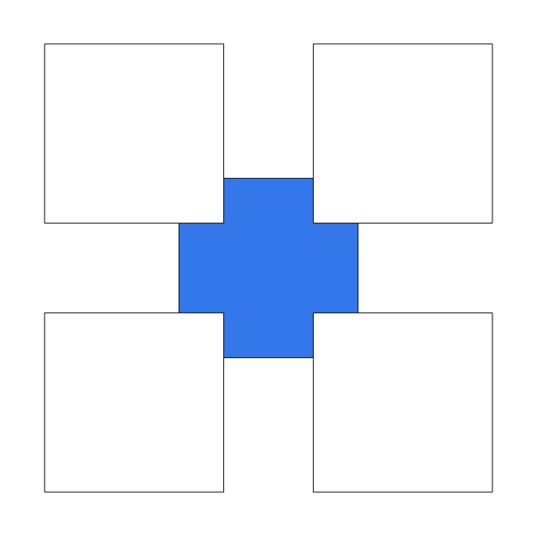

### Riddler Express 8/14/2020

Original post [here](https://fivethirtyeight.com/features/are-you-hip-enough-to-be-square/) (fivethirtyeight.com).

From Dean Ballard comes a sneaky sorting of squares:

> You have a large pile of squares that each have a side length of 1 inch. One square is blue, while all the other squares are white. You want to arrange several white squares so they cover part of the blue square but don’t overlap with each other.
>
> For example, here’s how you could arrange four white squares so they each cover part of the blue square.
>
> 
>
> What is the greatest number of white squares you can place so that each covers part of the blue square without overlapping one another? (The entire blue square does not have to be covered, while the blue area that each white square covers must be nonzero.)*

### Answer

I was able to create an arrangement with an overlap of **8** squares.

### Idea

The intuitive way to think about this to observe that although you can do a "simple" overlap of 1 white square and 1 blue square at a blue square corner:

 
...you get more "bang for your buck" by overlapping **2** white squares at a blue square corner:

My strategy was to maximize the number of blue corners that overlap with 2 white squares.

#### 4 Squares

This is given in the problem statement.

#### 5 Squares

Note, no doubling up of blue square corners:

#### 6 Squares

Two corners are doubled up:

#### 7 Squares

Again, two corners are doubled up:

#### 8 Squares

The best I could come up with was this, with 3 doubled-up blue corners:

Is it just me or does that look kinda like a hockey goalie?

